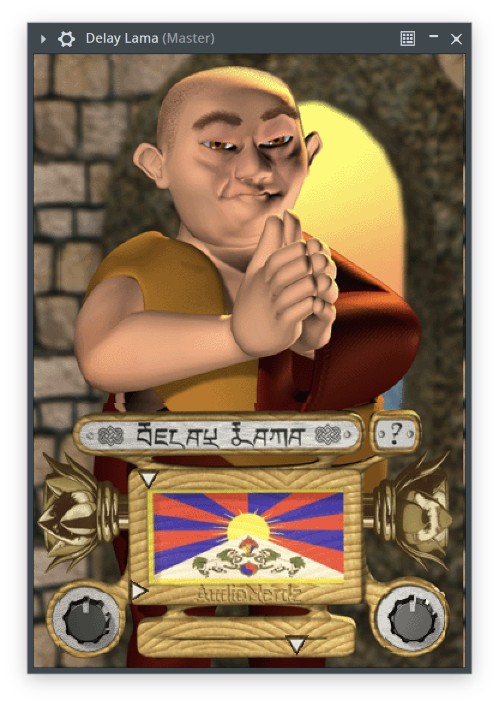

# DelayLama



**Delay Lama** makes your computer sound and look like a singing Tibetan monk. Delay Lama is the first software synthesizer that features both vocal synthesis and a real-time 3D animated interface, which dynamically reacts to musical gestures from the user.

To control the pitch and vowel sound (ooh-ow-ah-ayh-eeh), either a MIDI keyboard with pitchbender, or the built-in XY-controller can be used. For an extra mystical effect, Delay Lama has a simple stereo delay.

## Build

The root Rust package owns DSP, host state, editor state, artwork, and format exports:

```sh
just rust-test
just rust-build
just rust-bundles
```

Editor artwork is stored as lossless QOI and decoded directly into RGBA texture data.

Build universal macOS raw bundles and a local installer for Apple Silicon and Intel:

```sh
set -a; . ./.env; set +a
export DEVELOPER_DIR=/Applications/Xcode-26.6.0.app/Contents/Developer
just universal-macos-package
```

The installer is written to `target/dist/`, and the raw bundles are copied to
`target/universal-bundles/`. The bundles use `TRUCE_SIGNING_IDENTITY`. The installer
is not notarized and is signed only when `TRUCE_INSTALLER_SIGNING_IDENTITY` is set.

Build the AUv3 with full Xcode:

```sh
set -a; . ./.env; set +a
export DEVELOPER_DIR=/Applications/Xcode-26.6.0.app/Contents/Developer
just install-auv3-dev
just verify-auv3-registration
```

## Test

```sh
just rust-test
cargo fmt --all -- --check
cargo clippy --all-targets --all-features
```

Remove the development AUv3 registration with `just uninstall-auv3-dev`.

## Attributions

Description taken from [KVR](https://www.kvraudio.com/product/delay_lama_by_audionerdz)

## License

AudioNerdz distributed Delay Lama as freeware. Redistribution requires permission from the relevant code, name, and artwork rights holders.
